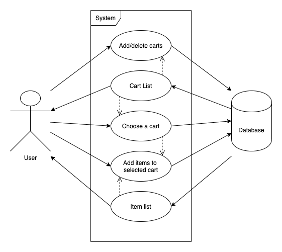
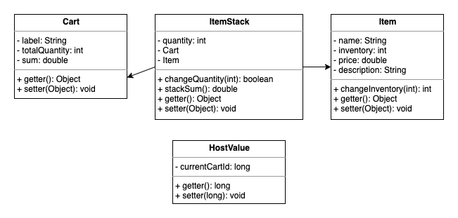
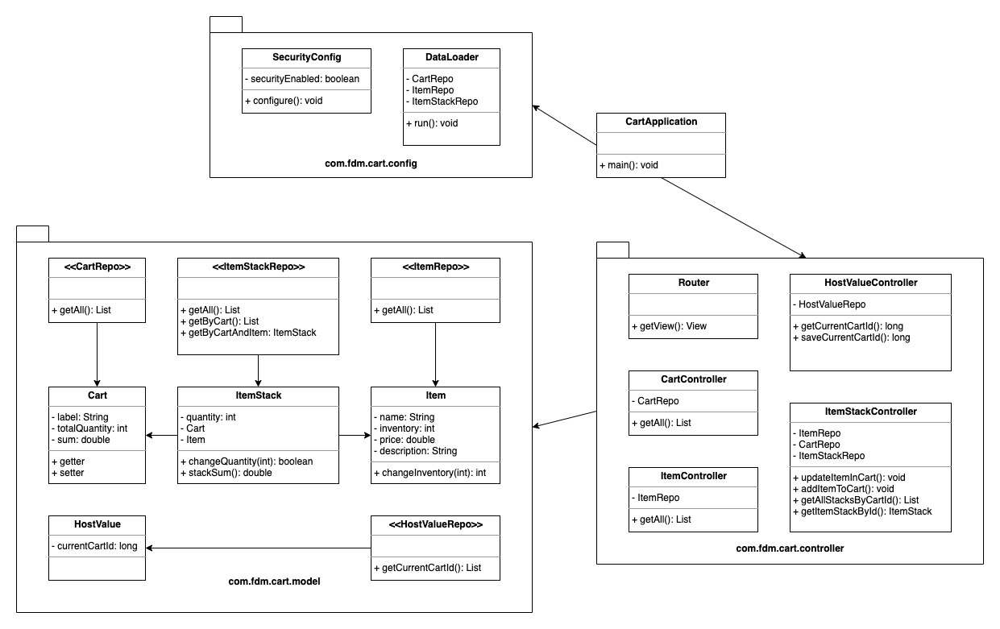

# OneDayProject-ShoppingCart

## build instruction

1. under working directory (`shoppingcart`) run `$ mvn spring-boot:run`.
1. user default credentials to login: 

> username: admin

> password: admin

## diagrams

1. Use Case

2. ERD

3. Class Relations

## update history
- 05181014: first commit. repository initiated. env setup. 
- 05191710: first submission.
- 05191722: second submission. add diagrams.

## tech stack
- lombok
- tomcat
- web
- thymeleaf
- security
- data-jpa
- h2
- bootstrap
- vue
- axios