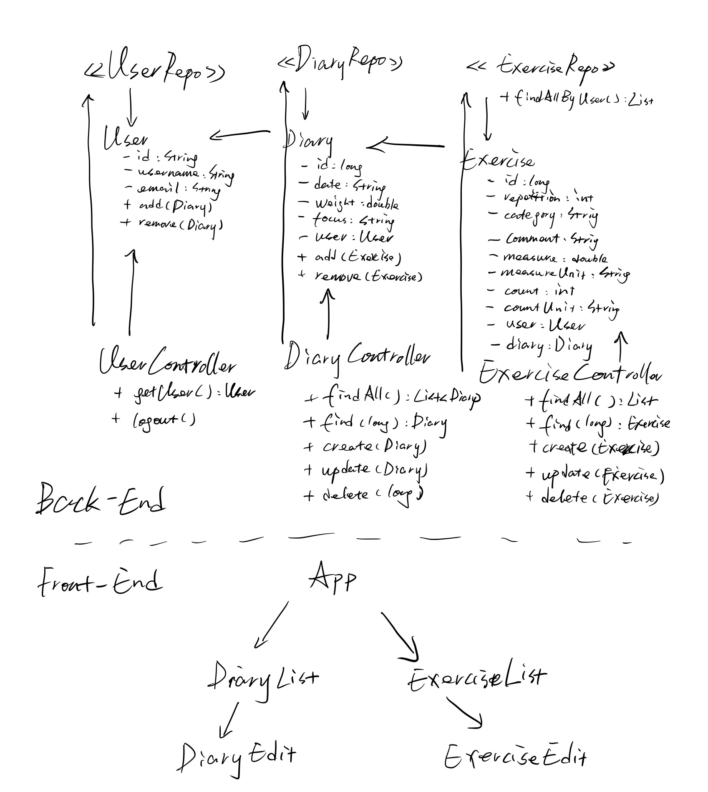

# gymloga

## description

This is a project to build a web app that enables users keeping log their gym activities. 

## update
- 04231500 front end research: chart.js lib
- 04221600 remake backend due to restful api not compatible: Spring boot Rest data, and normal apis
- 04211500 react js hosting online
- 04201600 classes/entities built
- 04160000 mysql server available online
- 04141500 update host server that hosts an online demo
- 04062100 update readme; create dev branch.
- 04062050 housework: logger, db, properties.
- 04061813 init project.

## UML

## tech stacks
- back-end: 
	- Spring boot: security, jpa, web
	- Okta authentication
	- lombok annotation
	- tomcat
- front-end
	- React.js
	- reactstrap / bootstrap
- test, log & environment
	- junit
	- mockito
	- SpringbootTest
	- log4j2
	- maven
	- docker
- database:
	- h2
	- mysql

## acknowledgement
- [Spring.io guide of data-rest](https://spring.io/guides/tutorials/react-and-spring-data-rest/)
- [Okta's Crud app by _Matt Raible_](https://developer.okta.com/blog/2018/07/19/simple-crud-react-and-spring-boot)
- [Okta's guide of restful web app](https://developer.okta.com/blog/2017/12/06/bootiful-development-with-spring-boot-and-react)

## reflection:
- visual data
- multiuser by okta
- usability: validators + auto completion
- use more enums that can be selected from. but need to learn how to use that in react.js
- not fully restful, used attribute names in front end